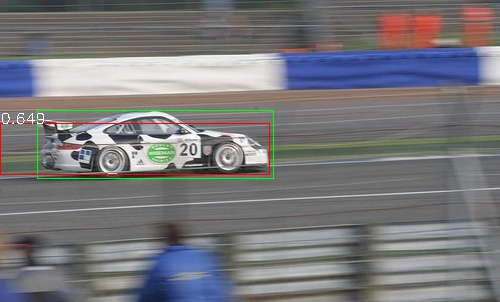

# RCNN_torch

Object detection(물체탐지)분야의 RCNN(2013) ( Regions with Convolutional Neuron Networks features ) architectures를 pytorch로 구현함.

| Original | inference result <BR> (red:pred, green: G.T, score: confidence. not IoU)|
|----------|-------------------------------------------|
|  |  |
 
**본 repository는 @zhujian 님의 `object-detection-algorithm/R-CNN` [github](https://github.com/object-detection-algorithm/R-CNN)을 바탕으로 공부하여 약간의 코드 수정, 한글 및 영어 주석 및 코드 리펙토링을 가미하였음을 밝힙니다.**

RCNN 논문 'Rich feature hierarchies for accurate object detection and semantic segmentation'[(paper link)](https://arxiv.org/abs/1311.2524)과 거의 유사한 방식으로 학습하고 inference할 수 있도록 pytorch 프레임 워크로 구현하였으므로 이해하기 어려웠던 데이터준비 및 bounding box regression loss와 같은 부분을 좀더 명확히 이해할 수 있을 것임.

본 RCNN_torch는 Pascal voc dataset(2007)에서 자동차 이미지만을 학습시키기 때문에 binary class object detection으로 구현되어 있음


## 데이터셋 및 모델 다운로드
아래 실행 파트의 순서를 진행하면 데이터셋과 모델을 생성할 수 있으나 실행시간 및 환경의 제약으로 `데이터셋 준비` 및 `모델 학습 및 생성`을 생략해야 한다면 아래 링크에서 파일을 다운받을 수 있음.
* RCNN_torch dataset & models (1.2Gb) : [download link](https://www.dropbox.com/s/1nw2b7r2i1dyz2w/RCNN_dataset_n_models.zip?dl=0)
* 압축을 풀고 RCNN_torch에 다음과 같이 위치시킨다.
  * `RCNN_torch/data/`
  * `RCNN_torch/models/`

## 실행 (End to end)
본 repository는 1.환경설정, 2.RCNN 데이터셋 준비, 3.모델 학습, 4.inference 단계로 준비되어 있음.

### 1. 환경설정
RCNN_torch git clone (혹은 다운로드 .zip으로도 가능)
```bash
git clone https://github.com/duc-ke/RCNN_torch.git
cd RCNN_torch
```

`python 3.8.12`를 기본으로 아래 라이브러리를 설치하였으나, 비어있는 환경에서 테스트 한것이 아니므로 진행 시, 추가 라이브러리 설치가 필요할 수 있음
```bash
pip install -r requirements.txt
```

### 2. 데이터셋 준비 (다운로드 링크에서 데이터셋을 다운받으면 생략 가능)
`data/` 디렉토리가 자동생성되며 그 하위에 아래와 같이 4가지 데이터셋 디렉토리가 생성(약 1.2Gb의 공간 필요)
  * `VOCdevkit/`
  * `voc_car/`
  * `finetune_car/`
  * `classifer_car/`
  * `bbox_regression/`
```bash
# 주의. 오래걸림. 약 2시간 예상
python load_dataset.py
```


### 3. 모델 학습 및 생성 (다운로드 링크에서 모델을 다운받으면 생략 가능)
* Feature extractor, Classifier(SVM), Bounding box regressor 3가지 모델을 생성해야 함.
* 전체 모델 학습을 위해 약 2.7Gb의 여유 공간 필요
```bash
# 1. Feature extractor fine-tuning (주의. 오래걸림. 약 5시간 예상)
python train_st1_feature_extractor.py

# 2. Classifier(SVM) model 학습 
python train_st2_classifer_svm.py

# 3. Bbox regressor model 학습
python train_st3_bbox_regression.py
```


### 4. inference 테스트
3가지 모델이 준비가 되어있어야만 inference가 가능. 현재 inference에는 bbox regressor model이 쓰이질 않고 있는데 이를 업데이트할 예정임.
```bash
# "imgs/" 디렉토리안에 들어있는 이미지를 inference 하도록 되어있음
python inference_detector.py
```
